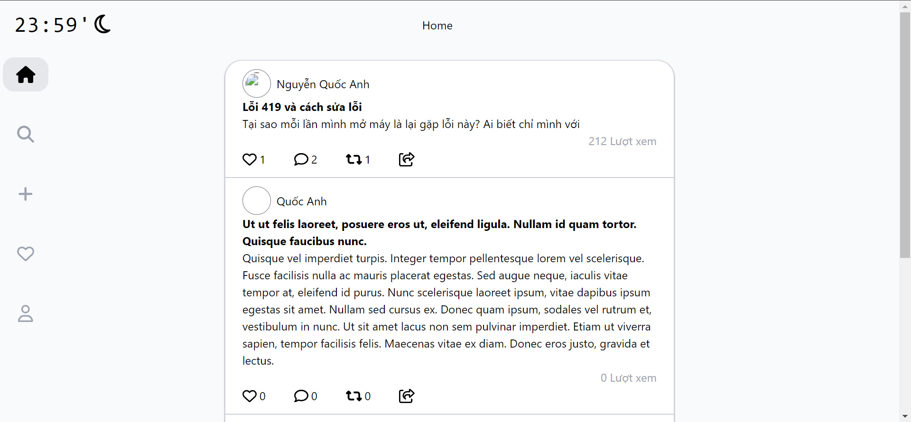
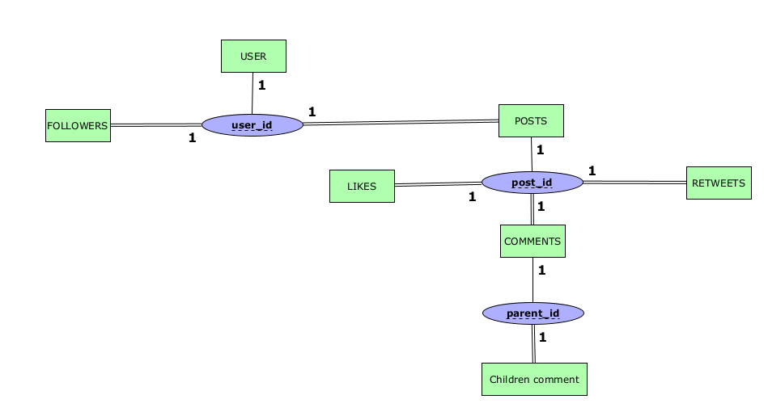

# Social Media Network

## Laravel 11 (API) + React 18 (SPA)


*Home page*


*ERD Diagram*

## Deploy

Laravel: https://thread-laravel.vercel.app

ReactJS: https://thread-reactjs.vercel.app

PostgreSQL: railway

## Cloning project
`git clone github.com/toi-la-qanh/Laravel.11-ReactJS`
### Install Laravel : 
```
cd laravel
composer install
```

Copy the .env.example file to create a new .env file:

`cp .env.example .env`

Generate Application Key:

`php artisan key:generate`

### Install ReactJS:

```
cd reactjs
npm install
```

### Install Tailwind CSS:

In `reactjs` folder:

```
npm install -D tailwindcss postcss autoprefixer
npx tailwindcss init -p
```

Configure `tailwind.config.js` to include your paths:

```
module.exports = {
  content: ['./src/**/*.{js,jsx,ts,tsx}', './public/index.html'],
  theme: {
    extend: {},
  },
  plugins: [],
};
```

Add Tailwind to `index.css`:

```
@tailwind base;
@tailwind components;
@tailwind utilities;
```

### Run local server:

From your main project,

```
cd laravel
php artisan serve
```

Then, 
```
cd ..
cd reactjs
npm run dev
```